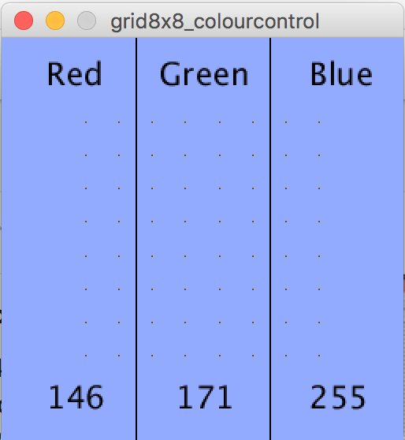

# grid8x8_colourcontrol

Sketch for Fadecandy LED control system: https://github.com/scanlime/fadecandy written in Processing, so these will need to be installed to use this script. Can be installed on Mac, Linux or Windows.

Control colour displayed on all LEDs with mouse

